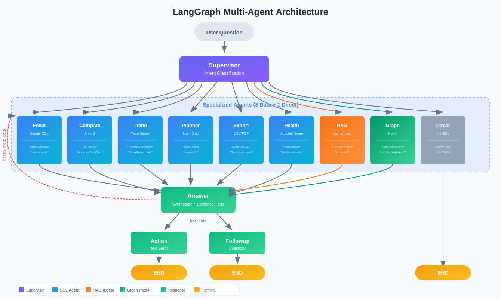
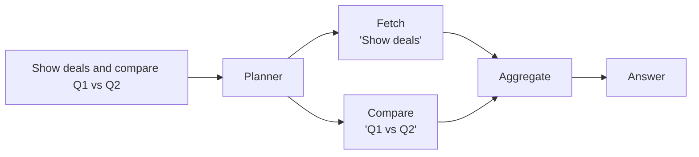
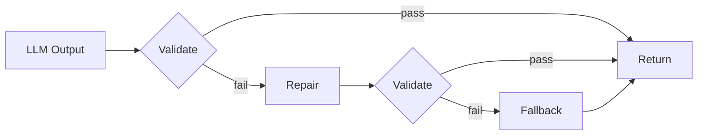
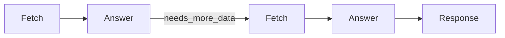
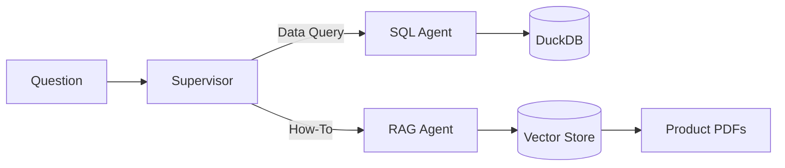

# CRM Agentic Reasoning Engine

**Multi-agent system that reasons over CRM data with grounded, evidence-backed answers.**

[](https://github.com/sazzad-kamal/crm-agentic-reasoning-engine/actions/workflows/ci.yml)
[](#quality)
[](#quality)
[](https://www.python.org/)
[](https://github.com/langchain-ai/langgraph)
[](https://www.llamaindex.ai/)
[](https://acme-crm-ai-companion-production.up.railway.app/)

<p align="center">
  <a href="https://acme-crm-ai-companion-production.up.railway.app/">
    
  </a>
</p>

<p align="center">
  
</p>

---

## The Problem

LLMs hallucinate. They fabricate data, invent statistics, and confidently cite sources that don't exist.

**This system is designed to eliminate hallucination.** Every claim links to actual CRM data with evidence tags. If the data doesn't exist, it tells you — it doesn't make something up.

---

## Architecture

<p align="center">
  
</p>

**7 specialized agents** orchestrated by LangGraph, each optimized for its query type:

| Query | Agent | What Happens |
|-------|-------|--------------|
| "Show Q1 deals" | **Fetch** | SQL generation → DuckDB |
| "Q1 vs Q2 revenue" | **Compare** | Parallel queries → Delta analysis |
| "Revenue trend" | **Trend** | Time-series → Growth metrics |
| "Deals and compare regions" | **Planner** | Decompose → Fan-out → Aggregate |
| "Export to CSV" | **Export** | Query → File generation |
| "Acme health score" | **Health** | Multi-factor scoring |
| "How do I import contacts?" | **RAG** | LlamaIndex → Semantic search → Docs |

---

## What Makes This Production-Grade

### 1. Planner: Multi-Agent Fan-Out

Complex queries are decomposed and routed to multiple agents in parallel:



### 2. Heuristics-First Classification

**90% of queries classified without LLM calls** — fast, cheap, deterministic:

| Pattern | Intent | LLM Call? |
|---------|--------|-----------|
| "export", "csv", "download" | EXPORT | No |
| "vs", "compare", "difference" | COMPARE | No |
| "trend", "over time", "growth" | TREND | No |
| Short or vague query | CLARIFY | No |
| Ambiguous intent | fallback | Yes |

### 3. Contract-Enforced Outputs

Every LLM output passes through: **Validate → Repair → Fallback**



**The system never crashes on malformed LLM output.** Pydantic contracts ensure type safety at every boundary.

### 4. Evidence-Grounded Responses

Every claim cites its source with traceable evidence tags:

```
The deal is in Negotiation [E1] valued at $50,000 [E2].

Evidence:
- E1: opportunities.stage = "Negotiation" (row 42)
- E2: opportunities.value = 50000 (row 42)
```

**No citation = no claim.** The answer generator is constrained to only reference retrieved data.

### 5. Data Refinement Loops

The Answer node can request additional data (max 2 iterations) before responding:



This handles follow-up questions like "What about their contact info?" without a new conversation turn.

### 6. SQL Safety Guard

All generated SQL is validated via `sqlglot` before execution:

- **Blocked**: `INSERT`, `UPDATE`, `DELETE`, `DROP`, `TRUNCATE`
- **Auto-injected**: `LIMIT 1000` (prevents runaway queries)
- **Parameterized**: No string interpolation (prevents SQL injection)

### 7. Hybrid Knowledge: CRM Data + Documentation

Two grounding sources in one system:

| Question Type | Source | Technology |
|---------------|--------|------------|
| "What deals closed Q1?" | **CRM Data** | SQL → DuckDB |
| "How do I import contacts?" | **Product Docs** | LlamaIndex → Vector Search |



**Why this matters**: Users ask questions about their data AND about how to use the product — both are grounded, never hallucinated.

---

## Tech Stack

| Layer | Technology | Why This Choice |
|-------|------------|-----------------|
| **Orchestration** | LangGraph | Stateful workflows, conditional edges, checkpointing |
| **SQL Generation** | Claude 3.5 | Superior structured output, fewer syntax errors |
| **Answer Synthesis** | GPT-4 | Natural language fluency, better citations |
| **RAG Pipeline** | LlamaIndex | Production-grade retrieval, hybrid search |
| **Analytics DB** | DuckDB | Columnar storage, fast aggregations, zero config |
| **Backend** | FastAPI | Async, OpenAPI docs, Pydantic validation |
| **Frontend** | React + TypeScript | Type-safe, component-driven, maintainable |
| **Streaming** | Server-Sent Events | Real-time updates, simple reconnection |

---

## Quality

| Metric | Value | Details |
|--------|-------|---------|
| **Total Tests** | **1,339** | [View CI →](https://github.com/sazzad-kamal/crm-agentic-reasoning-engine/actions) |
| Backend (pytest) | 610 | Unit + integration |
| Frontend (Vitest) | 562 | Components + hooks |
| E2E (Playwright) | 167 | Full user flows |
| **Code Coverage** | **95%** | Backend + Frontend combined |
| **Faithfulness** | ≥ 0.9 | [RAGAS](https://docs.ragas.io/) evaluation |
| **p50 Latency** | < 3s | Measured on production |

---

## Quick Start

### Prerequisites

- Python 3.10+
- Node.js 18+
- OpenAI API key (answer synthesis)
- Anthropic API key (SQL generation)

### Setup

```bash
# Clone
git clone https://github.com/sazzad-kamal/crm-agentic-reasoning-engine.git
cd crm-agentic-reasoning-engine

# Backend
python -m venv .venv
source .venv/bin/activate      # Linux/macOS
# .venv\Scripts\activate       # Windows

pip install -r requirements.txt
cp .env.example .env           # Add your OPENAI_API_KEY
uvicorn backend.main:app --reload

# Frontend (new terminal)
cd frontend
npm install
npm run dev
```

Open [http://localhost:5173](http://localhost:5173)

### Mock Mode (No API Key)

```bash
export MOCK_LLM=1              # Linux/macOS
# set MOCK_LLM=1               # Windows
uvicorn backend.main:app --reload
```

---

## API

### Chat Endpoint

```http
POST /api/chat/stream
Content-Type: application/json

{"question": "What deals closed this quarter?"}
```

### SSE Event Stream

| Event | Description |
|-------|-------------|
| `fetch_start` | Query execution began |
| `answer_chunk` | Streamed answer token |
| `evidence` | Citation data |
| `action` | Suggested CRM action |
| `followup` | Follow-up question suggestions |
| `done` | Stream complete |

### API Documentation

- Swagger UI: [http://localhost:8000/docs](http://localhost:8000/docs)
- ReDoc: [http://localhost:8000/redoc](http://localhost:8000/redoc)

---

## Project Structure

```
├── backend/
│   ├── agent/           # LangGraph agents (fetch, compare, trend, etc.)
│   ├── api/             # FastAPI routes
│   ├── rag/             # LlamaIndex pipeline
│   └── main.py          # Application entry
├── frontend/
│   ├── src/
│   │   ├── components/  # React components
│   │   ├── hooks/       # Custom hooks (streaming, data)
│   │   └── styles/      # CSS
│   └── e2e/             # Playwright tests
├── docs/                # Architecture diagrams
└── tests/               # Backend tests
```

---

## Documentation

- [Architecture Deep Dive](docs/ARCHITECTURE.md) — System design, agent interactions, design decisions
- [Code Map](docs/CODE_MAP.md) — File-by-file reference with line numbers
- [Data Flow](docs/data-flow.md) — Request lifecycle with ASCII diagrams
- [LangGraph Diagram](docs/LANGGRAPH_DIAGRAM.md) — Visual graph of agent orchestration
- [API Reference](http://localhost:8000/docs) — OpenAPI documentation (Swagger UI)

---

## Development

```bash
# Run backend tests
pytest tests/ -v

# Run frontend tests
cd frontend && npm test

# Run E2E tests
cd frontend && npm run test:e2e

# Lint & type check
ruff check backend/
mypy backend/
cd frontend && npm run lint && npx tsc --noEmit
```

---

## Contributing

Contributions are welcome! Please:

1. Fork the repository
2. Create a feature branch (`git checkout -b feature/amazing-feature`)
3. Commit your changes (`git commit -m 'Add amazing feature'`)
4. Push to the branch (`git push origin feature/amazing-feature`)
5. Open a Pull Request

---

## License

MIT License — see [LICENSE](LICENSE) for details.

---

<p align="center">
  <strong>Built by <a href="https://github.com/sazzad-kamal">Sazzad Kamal</a></strong><br/>
  <em>AI Engineer • Full-Stack Developer</em>
</p>
