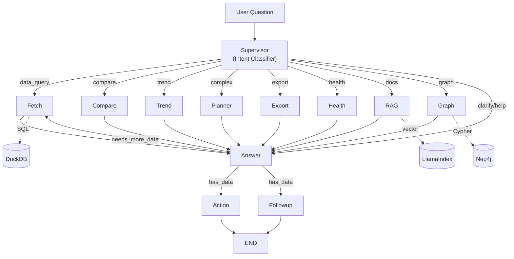
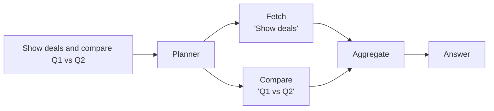
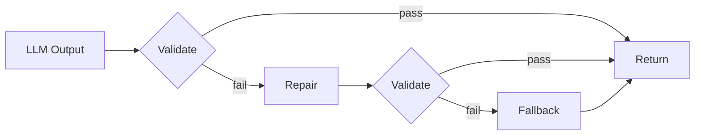
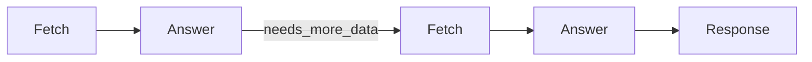
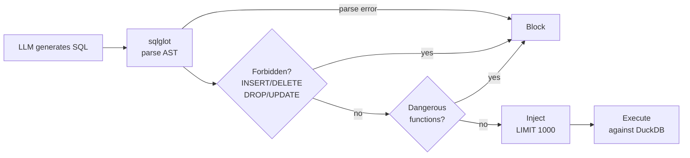
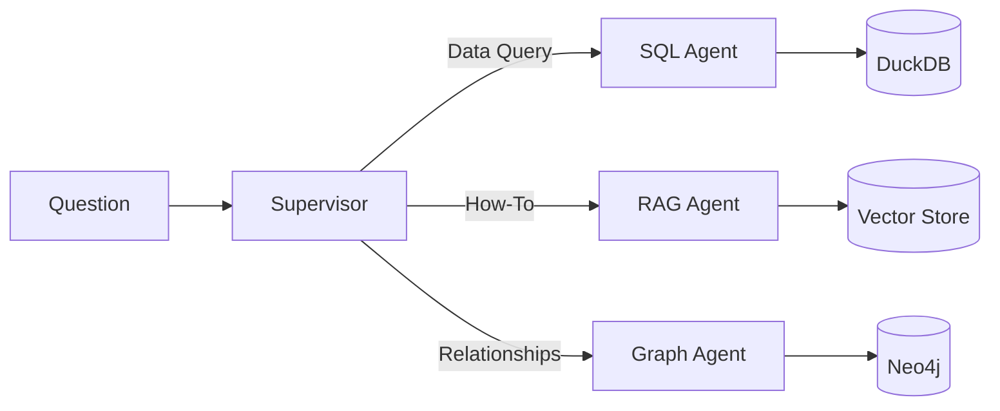
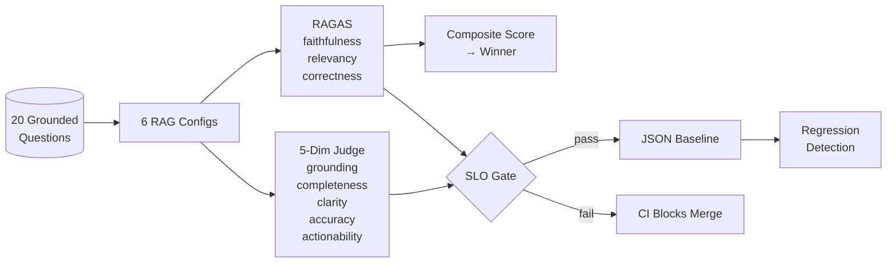

# CRM Agentic Reasoning Engine

**Multi-agent system that reasons over CRM data with grounded, evidence-backed answers.**

[](https://github.com/sazzad-kamal/crm-agentic-reasoning-engine/actions/workflows/backend.yml)
[](#quality)
[](#quality)
[](https://www.python.org/)
[](https://github.com/langchain-ai/langgraph)
[](https://www.llamaindex.ai/)
[](https://neo4j.com/)
[](https://acme-crm-ai-companion-production.up.railway.app/)

<p align="center">
  <a href="https://acme-crm-ai-companion-production.up.railway.app/">
    
  </a>
</p>

<p align="center">
  
</p>

---

## The Problem

CRM teams need answers from three sources: structured data (deals, contacts), product documentation, and entity relationships. LLMs hallucinate across all three — fabricating numbers, inventing features, and confidently describing relationships that don't exist.

**This system grounds every answer in real data.** SQL queries hit DuckDB, documentation search hits LlamaIndex, relationship queries hit Neo4j. Every claim cites its source with evidence tags. Quality is measured with RAGAS metrics and enforced via SLOs in CI.

---

## Architecture



**10 intent types** routed by a supervisor to **8 specialized agents**, orchestrated by LangGraph:

| Query | Agent | What Happens |
|-------|-------|--------------|
| "Show Q1 deals" | **Fetch** | SQL generation → DuckDB |
| "Q1 vs Q2 revenue" | **Compare** | Parallel queries → Delta analysis |
| "Revenue trend" | **Trend** | Time-series → Growth metrics |
| "Deals and compare regions" | **Planner** | Decompose → Fan-out → Aggregate |
| "Export to CSV" | **Export** | Query → File generation |
| "Acme health score" | **Health** | Multi-factor scoring |
| "How do I import contacts?" | **RAG** | LlamaIndex → Semantic search → Docs |
| "Who works with at-risk companies?" | **Graph** | Cypher → Neo4j → Multi-hop traversal |

---

## What Makes This Production-Grade

### 1. Planner: Multi-Agent Fan-Out

Complex queries are decomposed and routed to multiple agents in parallel:



### 2. Heuristics-First Classification

**90% of queries classified without LLM calls** — fast, cheap, deterministic:

| Pattern | Intent | LLM Call? |
|---------|--------|-----------|
| "export", "csv", "download" | EXPORT | No |
| "vs", "compare", "difference" | COMPARE | No |
| "trend", "over time", "growth" | TREND | No |
| "how do I", "how to" + Act! keyword | DOCS | No |
| "connected to", "relationship" | GRAPH | No |
| "health score", "at risk" | HEALTH | No |
| Short or vague query | CLARIFY | No |
| Ambiguous intent | fallback | Yes |

### 3. Contract-Enforced Outputs

Every LLM output passes through: **Validate → Repair → Fallback**



**The system never crashes on malformed LLM output.** Pydantic contracts ensure type safety at every boundary.

### 4. Evidence-Grounded Responses

Every claim cites its source with traceable evidence tags:

```
The deal is in Negotiation [E1] valued at $50,000 [E2].

Evidence:
- E1: opportunities.stage = "Negotiation" (row 42)
- E2: opportunities.value = 50000 (row 42)
```

**No citation = no claim.** The answer generator is constrained to only reference retrieved data.

### 5. Data Refinement Loops

The Answer node can request additional data (max 2 iterations) before responding:



### 6. SQL Safety Guard

All generated SQL is validated via `sqlglot` before execution:



### 7. Hybrid Knowledge: CRM Data + Documentation + Knowledge Graph

Three grounding sources in one system:

| Question Type | Source | Technology |
|---------------|--------|------------|
| "What deals closed Q1?" | **CRM Data** | SQL → DuckDB |
| "How do I import contacts?" | **Product Docs** | LlamaIndex → Vector Search |
| "Who at at-risk companies has deals closing?" | **Knowledge Graph** | Cypher → Neo4j |



### 8-10. Evaluation Pipeline



### 8. RAG Retrieval Strategy Comparison

Automated pipeline comparing **6 retrieval configurations** across 20 grounded questions using RAGAS metrics:

| Config | Retriever | Top-K | Reranker |
|--------|-----------|-------|----------|
| vector_top5 | Vector | 5 | None |
| vector_top10 | Vector | 10 | None |
| bm25_top5 | BM25 | 5 | None |
| hybrid_top5 | Vector + BM25 (RRF) | 5 | None |
| vector_top10_rerank5 | Vector | 10 | SentenceTransformer |
| hybrid_top10_rerank5 | Vector + BM25 | 10 | SentenceTransformer |

Winner selected by composite score: `0.4 * relevancy + 0.4 * faithfulness + 0.2 * correctness`

```bash
python -m backend.eval.rag_comparison --limit 5
```

### 9. 5-Dimension Answer Quality Judge

LLM-as-Judge scores every answer on 5 CRM-specific dimensions:

| Dimension | What It Measures |
|-----------|-----------------|
| **Grounding** | Every claim has evidence tags, no fabrication |
| **Completeness** | All parts of the question addressed |
| **Clarity** | Well-structured, easy to scan |
| **Accuracy** | Numbers/names match CRM data |
| **Actionability** | Practical next steps suggested |

### 10. Quality Gates & SLOs

CI-enforced quality thresholds with regression tracking:

| SLO | Threshold | Enforcement |
|-----|-----------|-------------|
| Faithfulness | >= 0.9 | RAGAS evaluation |
| Answer Relevancy | >= 0.85 | RAGAS evaluation |
| p50 Latency | < 3s | Integration eval |
| Pass Rate | >= 80% | CI quality gate |

JSON baseline export enables regression detection across retrieval config changes.

```bash
python -m backend.eval.integration.gate --limit 5
```

---

## Tech Stack

| Layer | Technology | Why This Choice |
|-------|------------|-----------------|
| **Orchestration** | LangGraph | Stateful workflows, conditional edges, checkpointing |
| **SQL Generation** | Claude 3.5 | Superior structured output, fewer syntax errors |
| **Answer Synthesis** | GPT-4 | Natural language fluency, better citations |
| **RAG Pipeline** | LlamaIndex | Production-grade retrieval, hybrid search |
| **Graph DB** | Neo4j | Multi-hop entity traversal, Cypher queries |
| **Analytics DB** | DuckDB | Columnar storage, fast aggregations, zero config |
| **Evaluation** | RAGAS | Faithfulness, relevancy, correctness metrics |
| **Backend** | FastAPI | Async, OpenAPI docs, Pydantic validation |
| **Frontend** | React + TypeScript | Type-safe, component-driven |
| **Streaming** | Server-Sent Events | Real-time updates, simple reconnection |

---

## Quality

| Metric | Value |
|--------|-------|
| **Backend Tests** | 691 passing (pytest) |
| **Code Coverage** | 83% |
| **Faithfulness SLO** | >= 0.9 (RAGAS) |
| **p50 Latency SLO** | < 3s |

---

## Quick Start

### Prerequisites

- Python 3.10+
- Node.js 18+
- OpenAI API key (answer synthesis)
- Anthropic API key (SQL generation)
- Neo4j (optional — for graph relationship queries)

### Setup

```bash
# Clone
git clone https://github.com/sazzad-kamal/crm-agentic-reasoning-engine.git
cd crm-agentic-reasoning-engine

# Neo4j (optional — skip if you don't need graph queries)
docker compose up neo4j -d

# Backend
python -m venv .venv
source .venv/bin/activate      # Linux/macOS
# .venv\Scripts\activate       # Windows

pip install -r requirements.txt
cp .env.example .env           # Add your API keys
uvicorn backend.main:app --reload

# Frontend (new terminal)
cd frontend
npm install
npm run dev
```

Open [http://localhost:5173](http://localhost:5173)

### API

```http
POST /api/chat/stream
Content-Type: application/json

{"question": "What deals closed this quarter?"}
```

```http
GET /api/data/companies      # CRM data explorer
GET /api/data/opportunities
GET /api/data/contacts
GET /api/data/activities
```

API docs: [http://localhost:8000/docs](http://localhost:8000/docs)

---

## Project Structure

```
backend/
├── agent/
│   ├── sql/             # Shared SQL infrastructure (connection, planner, guard, executor)
│   ├── fetch/           # SQL data queries
│   ├── compare/         # A vs B comparisons
│   ├── trend/           # Time-series analysis
│   ├── health/          # Account health scoring
│   ├── export/          # CSV/PDF generation
│   ├── planner/         # Complex query decomposition
│   ├── rag/             # LlamaIndex documentation search
│   ├── graph_rag/       # Neo4j multi-hop graph queries
│   ├── supervisor/      # Intent classification + routing
│   ├── validate/        # Contract enforcement (validate → repair → fallback)
│   ├── answer/          # Evidence-grounded answer synthesis
│   ├── action/          # Suggested next actions
│   ├── followup/        # Follow-up question generation
│   └── graph.py         # LangGraph orchestration (wires all nodes)
├── eval/
│   ├── answer/          # RAGAS metrics + 5-dimension LLM judge
│   ├── rag_comparison/  # 6-strategy retrieval comparison pipeline
│   ├── integration/     # End-to-end conversation eval + quality gates
│   ├── fetch/           # SQL generation accuracy eval
│   └── followup/        # Follow-up quality eval
├── api/                 # FastAPI routes (chat, data)
└── core/                # Shared LLM config
```

---

## Documentation

- [Architecture Deep Dive](docs/ARCHITECTURE.md) — System design, agent interactions, design decisions
- [Code Map](docs/CODE_MAP.md) — File-by-file reference with line numbers
- [Data Flow](docs/data-flow.md) — Request lifecycle with ASCII diagrams
- [LangGraph Diagram](docs/LANGGRAPH_DIAGRAM.md) — Visual graph of agent orchestration

---

<p align="center">
  <strong>Built by <a href="https://github.com/sazzad-kamal">Sazzad Kamal</a></strong>
</p>
