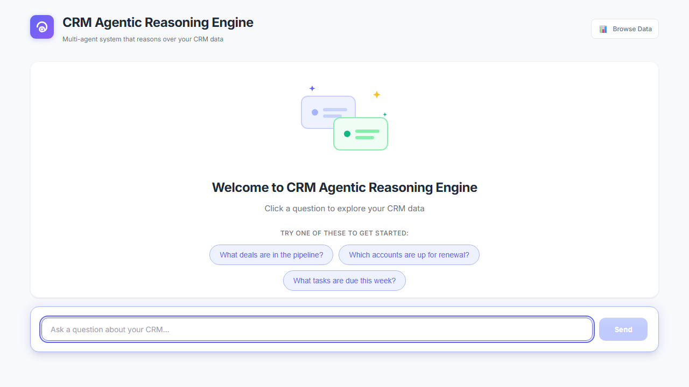
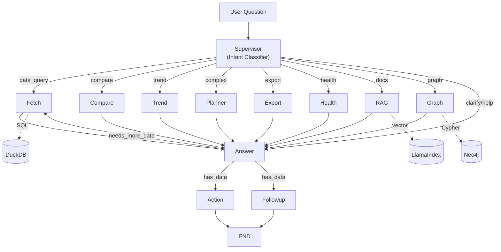
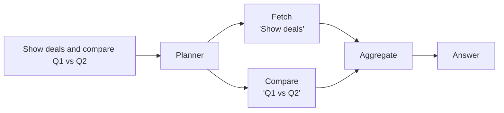
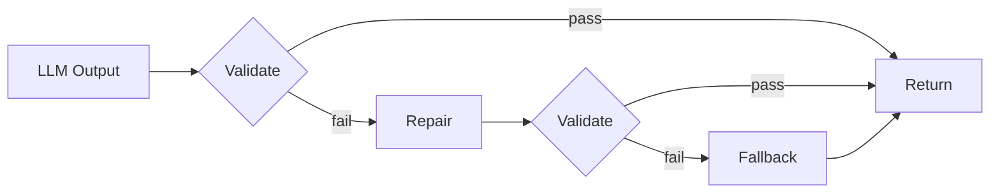
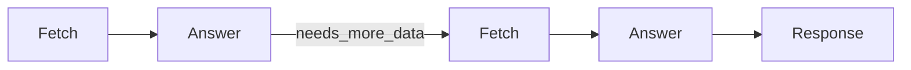
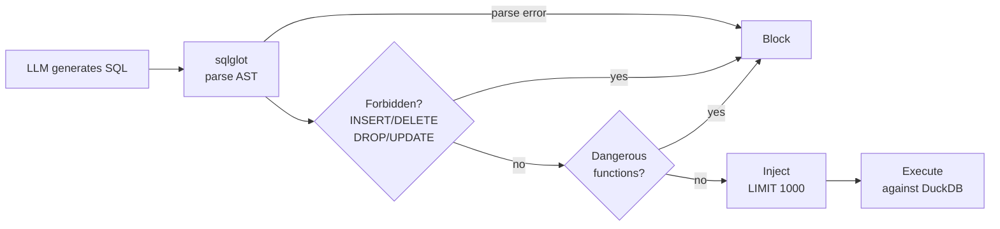
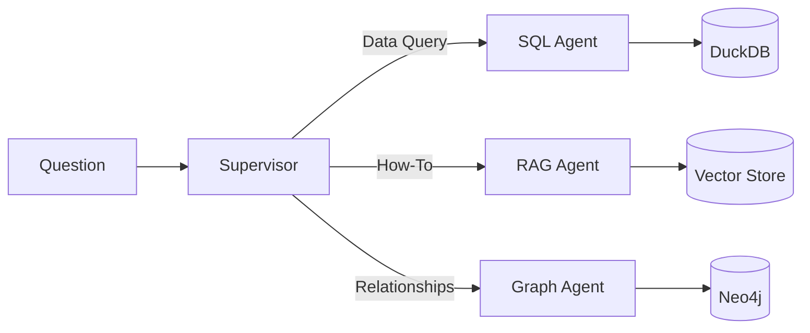
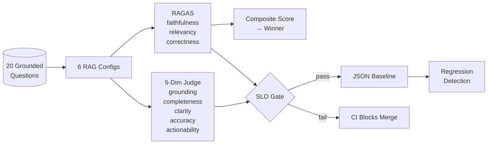

# CRM Agentic Reasoning Engine

**Multi-agent system that reasons over CRM data with grounded, evidence-backed answers.**

[](https://github.com/sazzad-kamal/crm-agentic-reasoning-engine/actions/workflows/backend.yml)
[](#quality)
[](#quality)
[](https://www.python.org/)
[](https://github.com/langchain-ai/langgraph)
[](https://www.llamaindex.ai/)
[](https://neo4j.com/)
[](https://acme-crm-ai-companion-production.up.railway.app/)

<p align="center">
  <a href="https://acme-crm-ai-companion-production.up.railway.app/">
    
  </a>
</p>

<p align="center">
  
</p>

---

## The Problem

CRM teams need answers from three sources: structured data (deals, contacts), product documentation, and entity relationships. LLMs hallucinate across all three — fabricating numbers, inventing features, and confidently describing relationships that don't exist.

**This system grounds every answer in real data.** SQL queries hit DuckDB, documentation search hits LlamaIndex, relationship queries hit Neo4j. Every claim cites its source with evidence tags. Quality is measured with RAGAS metrics and enforced via SLOs in CI.

---

## Architecture



**10 intent types** routed by a supervisor to **8 specialized agents**, orchestrated by LangGraph:

| Query | Agent | What Happens |
|-------|-------|--------------|
| "Show Q1 deals" | **Fetch** | SQL generation → DuckDB |
| "Q1 vs Q2 revenue" | **Compare** | Parallel queries → Delta analysis |
| "Revenue trend" | **Trend** | Time-series → Growth metrics |
| "Deals and compare regions" | **Planner** | Decompose → Fan-out → Aggregate |
| "Export to CSV" | **Export** | Query → File generation |
| "Acme health score" | **Health** | Multi-factor scoring |
| "How do I import contacts?" | **RAG** | LlamaIndex → Semantic search → Docs |
| "Who works with at-risk companies?" | **Graph** | Cypher → Neo4j → Multi-hop traversal |

---

## What Makes This Production-Grade

### 1. Planner: Multi-Agent Fan-Out

Complex queries are decomposed and routed to multiple agents in parallel:



### 2. Heuristics-First Classification

**90% of queries classified without LLM calls** — fast, cheap, deterministic.

How the 90% was measured: the supervisor classifies each incoming query using keyword/pattern matching first. Only when no pattern matches (ambiguous intent) does it fall back to an LLM call. Across the evaluation question set, ~90% of queries hit a deterministic pattern, avoiding LLM classification latency and cost entirely.

| Pattern | Intent | LLM Call? |
|---------|--------|-----------|
| "export", "csv", "download" | EXPORT | No |
| "vs", "compare", "difference" | COMPARE | No |
| "trend", "over time", "growth" | TREND | No |
| "how do I", "how to" + Act! keyword | DOCS | No |
| "connected to", "relationship" | GRAPH | No |
| "health score", "at risk" | HEALTH | No |
| Short or vague query | CLARIFY | No |
| Ambiguous intent | fallback | Yes |

**Why this matters:** Each LLM classification call adds ~500ms-1s latency and costs tokens. Heuristics-first routing keeps p50 latency low and reduces API costs, while the LLM fallback ensures no query goes unhandled.

### 3. Contract-Enforced Outputs

Every LLM output passes through: **Validate → Repair → Fallback**



**The system never crashes on malformed LLM output.** Pydantic contracts ensure type safety at every boundary.

### 4. Evidence-Grounded Responses

Every claim cites its source with traceable evidence tags:

```
The deal is in Negotiation [E1] valued at $50,000 [E2].

Evidence:
- E1: opportunities.stage = "Negotiation" (row 42)
- E2: opportunities.value = 50000 (row 42)
```

**No citation = no claim.** The answer generator is constrained to only reference retrieved data. The enforcement mechanism works as follows:

1. The answer prompt instructs the LLM to only make claims backed by evidence from the fetched data
2. Each claim must include an evidence tag (e.g., `[E1]`) linking to the specific database field and row
3. The evidence section maps each tag to its source: table, column, and row number
4. This makes every claim auditable — a reviewer can trace any number or fact back to the exact data point

This grounding discipline is what enables the faithfulness SLO >= 0.85 (RAGAS) — responses are measured against retrieved context, and claims without evidence are penalized.

### 5. Data Refinement Loops

The Answer node can request additional data (max 2 iterations) before responding:



**When does re-fetch trigger?** The answer node analyzes the fetched data and determines if it has enough information to fully answer the question. Examples:

- User asks "Show Q1 deals and their contact info" — first fetch returns deals, answer node detects missing contact data, re-fetches with a contact-focused query
- User asks a question that returns empty results — answer node re-fetches with a broader query before giving up

The max 2 iterations cap prevents infinite loops while allowing the system to self-correct incomplete data retrieval. This is what makes the system agentic — it reasons about what it knows and what it still needs.

### 6. SQL Safety Guard

All generated SQL is validated via `sqlglot` before execution:



### 7. Hybrid Knowledge: CRM Data + Documentation + Knowledge Graph

Three grounding sources in one system:

| Question Type | Source | Technology |
|---------------|--------|------------|
| "What deals closed Q1?" | **CRM Data** | SQL → DuckDB |
| "How do I import contacts?" | **Product Docs** | LlamaIndex → Vector Search |
| "Who at at-risk companies has deals closing?" | **Knowledge Graph** | Cypher → Neo4j |



### 8-10. Evaluation Pipeline



### 8. RAG Retrieval Strategy Comparison

Automated pipeline comparing **6 retrieval configurations** across 20 grounded questions using RAGAS metrics:

| Config | Retriever | Top-K | Reranker |
|--------|-----------|-------|----------|
| vector_top5 | Vector | 5 | None |
| vector_top10 | Vector | 10 | None |
| bm25_top5 | BM25 | 5 | None |
| hybrid_top5 | Vector + BM25 (RRF) | 5 | None |
| vector_top10_rerank5 | Vector | 10 | SentenceTransformer |
| hybrid_top10_rerank5 | Vector + BM25 | 10 | SentenceTransformer |

Winner selected by composite score: `0.4 * relevancy + 0.4 * faithfulness + 0.2 * correctness`

**Why these weights?** Relevancy and faithfulness are weighted equally at 0.4 each because they represent the two most critical qualities: the answer must address the question (relevancy) and must be grounded in retrieved context (faithfulness). Correctness is weighted lower at 0.2 because semantic similarity to a reference answer is sensitive to phrasing differences — a correct answer worded differently can score low on correctness but still be faithful and relevant.

The comparison pipeline runs all 6 configs against the same 20 grounded questions (questions with known correct answers), computes RAGAS metrics for each, and ranks by composite score to select the best configuration for production use.

```bash
python -m backend.eval.rag_comparison --limit 5
```

### 9. 5-Dimension Answer Quality Judge

LLM-as-Judge scores every **final answer** on 5 CRM-specific dimensions, each with its own SLO threshold:

| Dimension | What It Measures | SLO Threshold |
|-----------|-----------------|---------------|
| **Grounding** | Every claim has evidence tags, no fabrication | >= 0.70 |
| **Completeness** | All parts of the question addressed | >= 0.70 |
| **Clarity** | Well-structured, easy to scan | >= 0.70 |
| **Accuracy** | Numbers/names match CRM data | >= 0.80 |
| **Actionability** | Practical next steps suggested | >= 0.60 |

An answer **passes** only if it meets **all 5 dimension thresholds simultaneously**. The overall **pass rate** is the percentage of answers that pass all thresholds — CI requires >= 80% pass rate across all evaluated answers.

### 10. Quality Gates & SLOs

Two layers of CI-enforced quality gates protect every merge:

**Layer 1: RAG Retrieval Quality (RAGAS)**

Measures how well the retrieval pipeline finds and uses the right information:

| SLO | Threshold | What It Measures |
|-----|-----------|-----------------|
| Faithfulness | >= 0.85 | Are claims grounded in retrieved context? |
| Answer Relevancy | >= 0.85 | Does the answer address the question? |
| Answer Correctness | >= 0.35 | Semantic match with expected answer (lenient for phrasing/style) |

**Layer 2: Answer Quality (LLM-as-Judge)**

Measures the quality of the final answer delivered to the user:

| SLO | Threshold | What It Measures |
|-----|-----------|-----------------|
| Judge Pass Rate | >= 80% | % of answers passing all 5 dimension thresholds |
| Text Pass Rate | >= 80% | % of answers passing relevancy + faithfulness |

**Layer 3: Performance**

| SLO | Threshold | What It Measures |
|-----|-----------|-----------------|
| p50 Latency | <= 3s | Median response time |
| p95 Latency | <= 8s | Tail response time |
| Conversation Step Pass Rate | >= 95% | % of conversation steps that succeed |

**How it works:** CI runs the full evaluation pipeline on every PR. If any SLO fails, the merge is blocked. JSON baseline export enables regression detection — scores are compared against the previous baseline to catch quality degradation across code changes.

```bash
python -m backend.eval.integration.gate --limit 5
```

---

## Tech Stack

### Multi-LLM Strategy

The system uses different LLMs for different tasks based on their strengths — not a single model for everything:

| Task | Model | Why |
|------|-------|-----|
| **SQL Generation** | Claude | Superior structured output, fewer syntax errors when generating SQL from natural language |
| **Answer Synthesis** | GPT | Natural language fluency, better evidence citation formatting |

This multi-LLM approach means each model handles what it's best at. SQL generation requires precise, structured output (Claude excels here), while answer synthesis requires natural, readable prose with proper citation formatting (GPT excels here).

### Full Stack

| Layer | Technology | Why This Choice |
|-------|------------|-----------------|
| **Orchestration** | LangGraph | Stateful workflows, conditional edges, checkpointing |
| **RAG Pipeline** | LlamaIndex | Production-grade retrieval, hybrid search |
| **Graph DB** | Neo4j | Multi-hop entity traversal, Cypher queries |
| **Analytics DB** | DuckDB | Columnar storage, fast aggregations, zero config |
| **Evaluation** | RAGAS | Faithfulness, relevancy, correctness metrics |
| **Backend** | FastAPI | Async, OpenAPI docs, Pydantic validation |
| **Frontend** | React + TypeScript | Type-safe, component-driven |
| **Streaming** | Server-Sent Events | Real-time updates, simple reconnection |

---

## Quality

### Test Coverage

| Metric | Value |
|--------|-------|
| **Tests** | 691 passing (unit + integration + e2e) |
| **Code Coverage** | 83% |

### SLO Summary

| Category | SLO | Threshold |
|----------|-----|-----------|
| **RAG Retrieval** | Faithfulness | >= 0.85 |
| **RAG Retrieval** | Answer Relevancy | >= 0.85 |
| **RAG Retrieval** | Answer Correctness | >= 0.35 |
| **Answer Quality** | Judge Pass Rate (all 5 dimensions) | >= 80% |
| **Answer Quality** | Text Pass Rate (relevancy + faithfulness) | >= 80% |
| **Performance** | p50 Latency | <= 3s |
| **Performance** | p95 Latency | <= 8s |
| **Reliability** | Conversation Step Pass Rate | >= 95% |

All SLOs are enforced via CI — a failing SLO blocks the merge.

---

## Quick Start

### Prerequisites

- Python 3.10+
- Node.js 18+
- OpenAI API key (answer synthesis)
- Anthropic API key (SQL generation)
- Neo4j (optional — for graph relationship queries)

### Setup

```bash
# Clone
git clone https://github.com/sazzad-kamal/crm-agentic-reasoning-engine.git
cd crm-agentic-reasoning-engine

# Neo4j (optional — skip if you don't need graph queries)
docker compose up neo4j -d

# Backend
python -m venv .venv
source .venv/bin/activate      # Linux/macOS
# .venv\Scripts\activate       # Windows

pip install -r requirements.txt
cp .env.example .env           # Add your API keys
uvicorn backend.main:app --reload

# Frontend (new terminal)
cd frontend
npm install
npm run dev
```

Open [http://localhost:5173](http://localhost:5173)

> **No API keys?** Set `MOCK_LLM=1` in your `.env` to run with mock responses — full UI, no API costs.

### API

```http
POST /api/chat/stream
Content-Type: application/json

{"question": "What deals closed this quarter?"}
```

```http
GET /api/data/companies      # CRM data explorer
GET /api/data/opportunities
GET /api/data/contacts
GET /api/data/activities
```

API docs: [http://localhost:8000/docs](http://localhost:8000/docs)

---

## Project Structure

```
backend/
├── agent/
│   ├── sql/             # Shared SQL infrastructure (connection, planner, guard, executor)
│   ├── fetch/           # SQL data queries
│   ├── compare/         # A vs B comparisons
│   ├── trend/           # Time-series analysis
│   ├── health/          # Account health scoring
│   ├── export/          # CSV/PDF generation
│   ├── planner/         # Complex query decomposition
│   ├── rag/             # LlamaIndex documentation search
│   ├── graph_rag/       # Neo4j multi-hop graph queries
│   ├── supervisor/      # Intent classification + routing
│   ├── validate/        # Contract enforcement (validate → repair → fallback)
│   ├── answer/          # Evidence-grounded answer synthesis
│   ├── action/          # Suggested next actions
│   ├── followup/        # Follow-up question generation
│   └── graph.py         # LangGraph orchestration (wires all nodes)
├── eval/
│   ├── answer/          # RAGAS metrics + 5-dimension LLM judge
│   ├── rag_comparison/  # 6-strategy retrieval comparison pipeline
│   ├── integration/     # End-to-end conversation eval + quality gates
│   ├── fetch/           # SQL generation accuracy eval
│   └── followup/        # Follow-up quality eval
├── api/                 # FastAPI routes (chat, data)
└── core/                # Shared LLM config
```

---

## Documentation

- [Architecture Deep Dive](docs/ARCHITECTURE.md) — System design, agent interactions, design decisions
- [Code Map](docs/CODE_MAP.md) — File-by-file reference with line numbers
- [Data Flow](docs/data-flow.md) — Request lifecycle with ASCII diagrams
- [LangGraph Diagram](docs/LANGGRAPH_DIAGRAM.md) — Visual graph of agent orchestration

---

<p align="center">
  <strong>Built by <a href="https://github.com/sazzad-kamal">Sazzad Kamal</a></strong>
</p>
