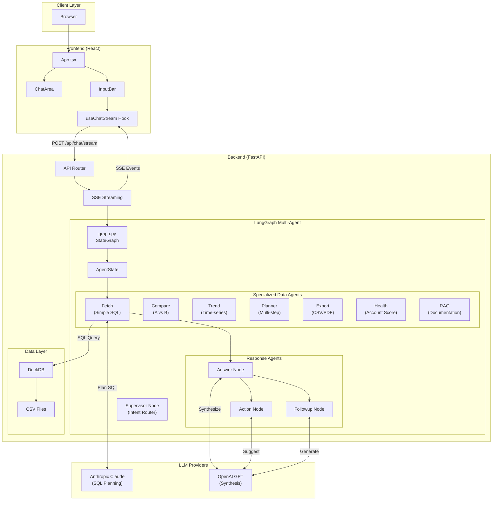
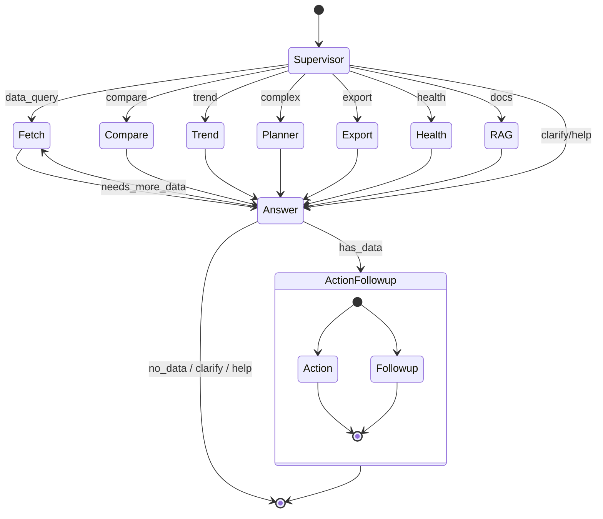
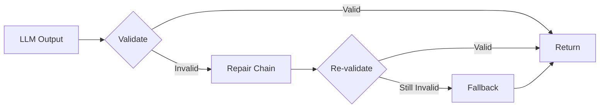
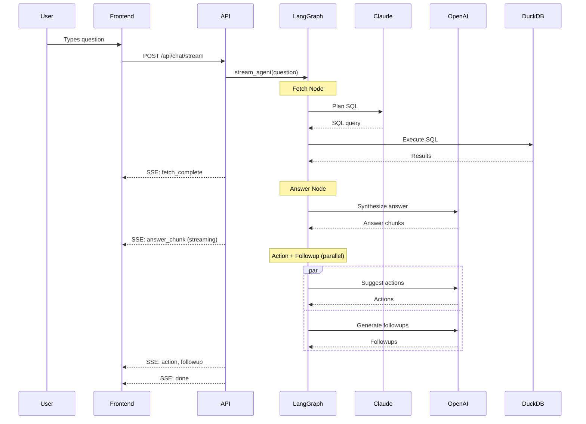

# Architecture

This document describes the system architecture of the Acme CRM AI Companion.

## Overview

The system is a conversational AI assistant that answers natural language questions about CRM data. It uses a **multi-agent LangGraph pipeline** with:

- **Supervisor routing**: Classifies intent and routes to 9 different specialized handlers
- **Data refinement loops**: Answer node can request additional data fetches
- **7 Specialized Agents**: Fetch, Compare, Trend, Planner, Export, Health, RAG
- **Response Agents**: Answer, Action, and Followup for generating responses
- **Hybrid grounding**: SQL for data queries, LlamaIndex for documentation

## System Diagram



## Agent Pipeline

The agent uses LangGraph to orchestrate a **multi-agent pipeline** with Supervisor routing and specialized agents:



### Supervisor Routing

The Supervisor node classifies user intent and routes to specialized agents:

| Intent | Description | Route | Example |
|--------|-------------|-------|---------|
| `data_query` | Simple CRM data lookup | Fetch → Answer | "Show all deals" |
| `compare` | Compare two entities | Compare → Answer | "Q1 vs Q2 revenue" |
| `trend` | Time-series analysis | Trend → Answer | "Revenue trend by month" |
| `complex` | Multi-part queries | Planner → Answer | "Show deals and compare trends" |
| `export` | Download/export data | Export → Answer | "Export contacts to CSV" |
| `health` | Account health score | Health → Answer | "Acme's health score" |
| `docs` | Product documentation | RAG → Answer | "How do I import contacts?" |
| `clarify` | Question is vague | Answer (asks for clarification) | "yes" |
| `help` | User wants help | Answer (describes capabilities) | "what can you do?" |

### Data Refinement Loop

The Answer node can detect when more data is needed:

1. Answer generates response from SQL results
2. If answer contains "data not available" for fetchable data → `needs_more_data=True`
3. Loop back to Fetch with refined context (max 2 iterations)
4. Continue to Action/Followup when complete

### Node Responsibilities

#### 0. Supervisor Node (`backend/agent/supervisor/`)

**Purpose**: Classify user intent and route to appropriate handler.

**Components**:
- `classifier.py`: Intent classification with heuristics + LLM fallback
- `node.py`: LangGraph node that returns intent and loop count

**Classification Logic**:
```
1. Quick heuristics (no LLM call):
   - Short/vague input → CLARIFY
   - Help phrases → HELP
   - Export keywords → EXPORT
   - Multi-part queries with "and" → COMPLEX
   - Compare keywords (vs, compare) → COMPARE
   - Trend keywords (trend, growth) → TREND
   - Health keywords → HEALTH
   - Data indicators → DATA_QUERY

2. LLM fallback for ambiguous cases:
   - Uses GPT-4o-mini for classification
   - Returns one of 8 intents
```

**Why Supervisor?**: Avoids running expensive SQL planning for non-data questions. Routes to specialized agents for better handling.

#### 1. Fetch Node (`backend/agent/fetch/`)

**Purpose**: Convert natural language to SQL and retrieve data.

**Components**:
- `planner.py`: Uses Claude to generate SQL from the question + schema
- `sql/executor.py`: Executes SQL against DuckDB
- `sql/schema.py`: Provides schema information to the planner

**Flow**:
```
Question → Claude (SQL Planning) → SQL Query → DuckDB → Results
```

**Why Claude?**: Claude provides better structured output for SQL generation with fewer hallucinated column names.

#### 1.1 Compare Agent (`backend/agent/compare/`)

**Purpose**: Handle comparison queries like "Compare Q1 vs Q2 revenue".

**Capabilities**:
- Extracts comparison entities from natural language
- Executes parallel SQL queries for each entity
- Calculates differences, percentages, and deltas
- Supports time period and entity comparisons

**Output**:
```python
{
    "comparison": {
        "entity_a": "Q1",
        "entity_b": "Q2",
        "metrics": {
            "revenue": {"Q1": 100000, "Q2": 150000, "difference": 50000, "percent_change": 50.0}
        }
    }
}
```

#### 1.2 Trend Agent (`backend/agent/trend/`)

**Purpose**: Analyze time-series data and detect trends.

**Capabilities**:
- Detects granularity (daily, weekly, monthly, quarterly, yearly)
- Enhances queries with grouping and ordering
- Calculates trend direction, growth rates, volatility
- Computes period-over-period changes

**Output**:
```python
{
    "trend_analysis": {
        "direction": "increasing",
        "percent_change": 25.5,
        "volatility": 12.3,
        "period_changes": [10.0, 15.0, 20.0]
    }
}
```

#### 1.3 Planner Agent (`backend/agent/planner/`)

**Purpose**: Orchestrate complex multi-step queries.

**Capabilities**:
- Decomposes complex questions into sub-queries
- Routes sub-queries to appropriate agents (Fetch, Compare, Trend)
- Aggregates results from multiple agents
- Handles dependencies between sub-queries

**Example**:
```
"Show deals and compare Q1 vs Q2" →
  1. Fetch: "Show deals"
  2. Compare: "Compare Q1 vs Q2"
  → Aggregated results
```

#### 1.4 Export Agent (`backend/agent/export/`)

**Purpose**: Generate downloadable files from query results.

**Capabilities**:
- Detects export format (CSV, PDF, JSON)
- Extracts underlying data query
- Generates files in temp directory
- Returns download URLs

**Supported Formats**:
- CSV: Full data export with headers
- JSON: Structured data export
- PDF: Report-style output (placeholder)

#### 1.5 Health Score Agent (`backend/agent/health/`)

**Purpose**: Calculate account health metrics and provide insights.

**Metrics**:
| Factor | Weight | Description |
|--------|--------|-------------|
| Deal Value | 25% | Total value of deals (log scale) |
| Deal Count | 15% | Number of deals |
| Win Rate | 20% | Won deals / closed deals |
| Activity Recency | 15% | Days since last activity |
| Pipeline Coverage | 15% | Open vs closed deal ratio |
| Renewal Status | 10% | Upcoming renewals |

**Output**:
```python
{
    "health_analysis": {
        "score": 78.5,
        "grade": "C",
        "insights": ["No activity in 45 days - schedule a check-in"]
    }
}
```

#### 1.6 RAG Agent (`backend/agent/rag/`)

**Purpose**: Answer "how-to" questions using Act! CRM documentation.

**Technology**: LlamaIndex with OpenAI embeddings

**Components**:
- `indexer.py`: Loads PDF documents and creates vector index
- `retriever.py`: Semantic search over documentation
- `node.py`: LangGraph node that returns grounded answers

**Capabilities**:
- Semantic search over Act! CRM documentation PDFs
- Retrieves relevant document chunks
- Synthesizes answers grounded in source material
- Returns source citations for transparency

**Why RAG?**: Users often need help with CRM features, not just data queries. RAG provides grounded answers from official documentation instead of hallucinated responses.

**Output**:
```python
{
    "rag_answer": "To import contacts, go to File > Import...",
    "rag_sources": [
        {"id": "D1", "source": "quick-start.pdf", "excerpt": "..."},
    ],
    "rag_confidence": 0.85
}
```

#### 2. Answer Node (`backend/agent/answer/`)

**Purpose**: Synthesize a human-readable answer from the data.

**Key Features**:
- Evidence tagging: Claims are linked to data via `[E1]`, `[E2]` markers
- Strict grounding: Only facts from retrieved data are allowed
- Structured output: Answer / Evidence / Data not available sections
- **Contract validation**: validate → repair → fallback pipeline

**Prompt Contract**:
```
You MUST:
- Only use facts from CRM DATA section
- Tag each claim with evidence markers [E1], [E2]...
- List evidence sources at the end
- Say "I don't have that information" if data is missing
```

**Contract Enforcement** (`backend/agent/validate/`):

Every response goes through a contract validation pipeline:



| Validator | Checks | Repair Strategy |
|-----------|--------|-----------------|
| Answer | Evidence tags, sections | Re-prompt with format instructions |
| Action | Numbered list, word count, owner prefix | Re-prompt with examples |
| Followup | Exactly 3 questions, max 10 words | Re-prompt with constraints |

**Grounding Verifier** (`backend/agent/validate/grounding.py`):

Optional critic stage that verifies claims are supported by CRM data:

```python
# Enable via flag
ENABLE_GROUNDING_VERIFICATION = True

# Verification process
1. Extract all factual claims from answer
2. For each claim, check if data supports it
3. Flag ungrounded or hallucinated claims
4. Log warnings (non-blocking)
```

#### 3. Action Node (`backend/agent/action/`)

**Purpose**: Suggest actionable next steps based on the answer.

**Output**: 1-4 action suggestions (or NONE if not applicable)

**Examples**:
- "Export this data to CSV"
- "Schedule a follow-up call"
- "Create a renewal reminder"

#### 4. Followup Node (`backend/agent/followup/`)

**Purpose**: Generate relevant follow-up questions.

**Strategy**:
1. First, try static followup tree (fast, deterministic)
2. If no match, use LLM to generate schema-aware questions

**Output**: Exactly 3 follow-up questions, each under 10 words.

## Data Flow

### Request Flow



### State Schema

```python
class AgentState(TypedDict):
    # Input
    question: str              # User's input question

    # Supervisor routing
    intent: str                # "data_query" | "clarify" | "help"
    loop_count: int            # Track Fetch→Answer iterations (max 2)
    needs_more_data: bool      # Answer signals it needs additional data

    # Data
    sql_results: dict          # {sql: str, data: list, _debug: {...}}

    # Outputs
    answer: str                # Synthesized answer
    suggested_action: str      # Action suggestions
    follow_up_suggestions: list[str]  # Follow-up questions
```

## LLM Strategy

### Multi-Provider Design

| Task | Provider | Model | Reason |
|------|----------|-------|--------|
| SQL Planning | Anthropic | Claude | Better structured output, fewer hallucinations |
| Answer Synthesis | OpenAI | GPT | Good at natural language synthesis |
| Action Suggestions | OpenAI | GPT | Creative suggestions |
| Followup Generation | OpenAI | GPT | Question generation |

### Fallback Behavior

If Anthropic API is unavailable, the system falls back to OpenAI for SQL planning.

## Streaming Architecture

The system uses Server-Sent Events (SSE) for real-time updates:

```python
# Event types
fetch_start      # Fetch node started
fetch_complete   # SQL executed, data retrieved
answer_chunk     # Streaming answer token
action           # Action suggestions ready
followup         # Follow-up questions ready
done             # Pipeline complete
error            # Error occurred
```

### Frontend Integration

```typescript
// useChatStream hook
const eventSource = new EventSource('/api/chat/stream');
eventSource.onmessage = (event) => {
  const data = JSON.parse(event.data);
  switch (data.type) {
    case 'answer_chunk':
      appendToAnswer(data.content);
      break;
    // ...
  }
};
```

## Evaluation Framework

The system includes a comprehensive evaluation framework with:
- **RAGAS metrics** for answer quality
- **Versioned eval cases** with checksums for reproducibility
- **Latency tracking** per question with percentile SLOs
- **Regression gate** for CI/CD integration

### Metrics

| Metric | Description | SLO |
|--------|-------------|-----|
| Pass Rate | Questions that meet all quality thresholds | ≥ 95% |
| Faithfulness | Claims grounded in retrieved data | ≥ 0.9 |
| Answer Relevancy | Answer addresses the question | ≥ 0.85 |
| Answer Correctness | Factually accurate answer | ≥ 0.85 |
| p50 Latency | Median response time | ≤ 3000ms |
| p95 Latency | 95th percentile response time | ≤ 8000ms |

### Eval Cases Versioning

```python
# backend/eval/shared/version.py
EVAL_CASES_VERSION = "1.0.0"  # Semantic version

# Each run records:
# - Version number
# - SHA256 checksum of questions.yaml
# - Stats (total questions, difficulty breakdown)
```

### Running Evaluations

```bash
# Full conversation evaluation
python -m backend.eval.integration [--limit N] [--output results.json]

# Regression gate (fails if SLOs not met)
python -m backend.eval.integration.gate [--baseline baseline.json]

# Answer quality evaluation
python -m backend.eval.answer

# Followup quality evaluation
python -m backend.eval.followup
```

### Regression Gate

The gate command (`python -m backend.eval.integration.gate`) provides CI/CD integration:

```bash
# Run with baseline comparison
python -m backend.eval.integration.gate --baseline baseline.json

# Exit codes:
# 0 = All SLOs passed
# 1 = SLO failures or regressions detected
```

Regression thresholds:
- Pass rate: Allow 2% drop from baseline
- Quality metrics: Allow 5% drop from baseline
- Latency: Allow 20% increase from baseline

## Security Considerations

### SQL Safety Guard (`backend/agent/fetch/sql/guard.py`)

All SQL queries pass through a safety guard before execution:

```python
# Blocked operations
INSERT, UPDATE, DELETE, DROP, CREATE, ALTER, GRANT

# Blocked functions
read_csv (prevents file access)

# Safety measures
- Auto-adds LIMIT 1000 to prevent memory exhaustion
- Validates with sqlglot parsing
- Logs blocked queries for monitoring
```

### Current State
- **SQL Guard**: All LLM-generated SQL is validated before execution
- **Input validation**: Pydantic models for request/response
- **CORS**: Restricted to allowed frontend origins
- **Evidence grounding**: Answers must cite data sources

### Recommended Improvements
- Rate limiting on API endpoints
- Query result caching with TTL
- Audit logging for all SQL executions

## Performance

### Latency Breakdown (typical)

| Stage | Latency |
|-------|---------|
| SQL Planning (Claude) | 500-800ms |
| SQL Execution (DuckDB) | 10-50ms |
| Answer Synthesis (GPT) | 1-2s |
| Action + Followup | 500ms |
| **Total** | **2-3.5s** |

### Optimization Opportunities
- Parallel LLM calls where possible
- Caching for common queries
- Streaming reduces perceived latency
