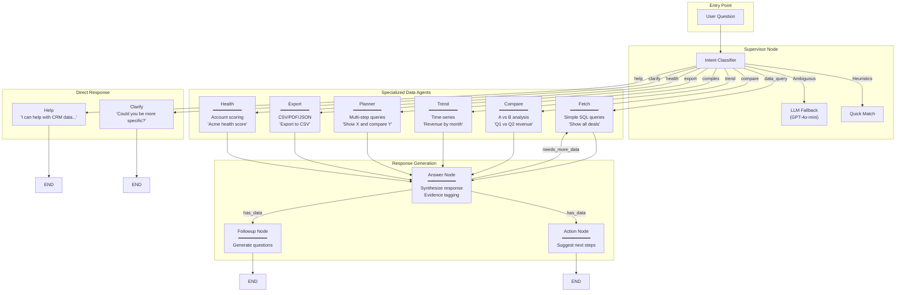
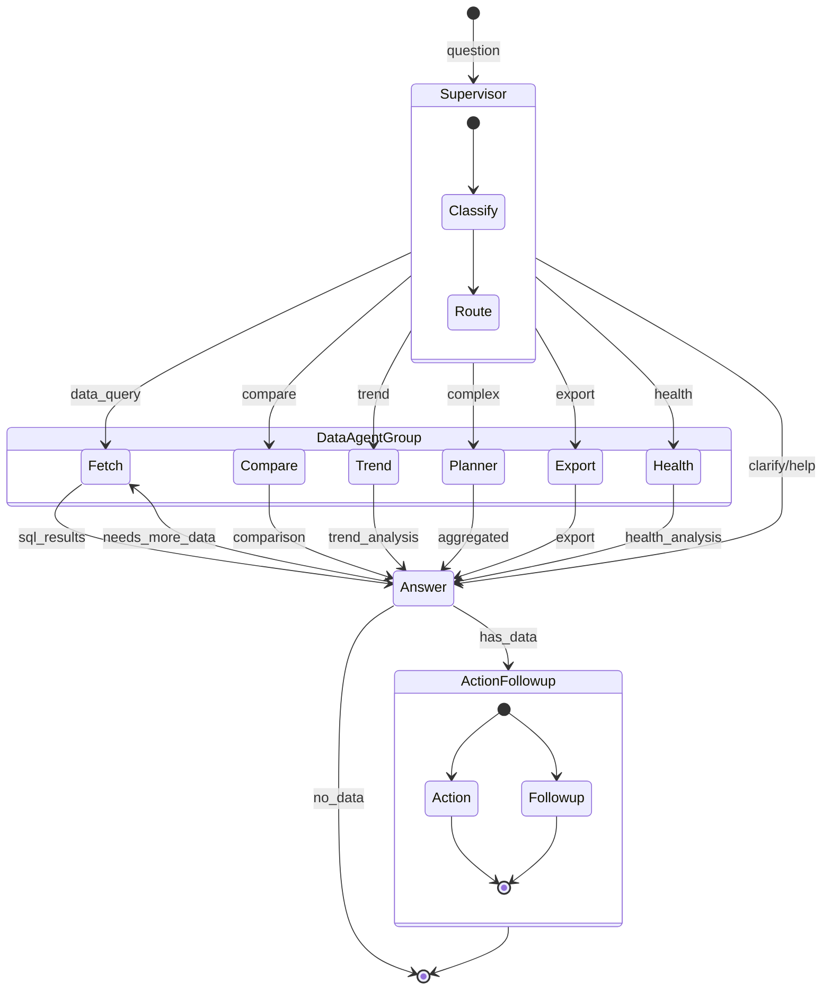

# LangGraph Multi-Agent Architecture

## Complete Flow Diagram



## State Flow



## Intent Classification

```
┌─────────────────────────────────────────────────────────────────┐
│                    INTENT CLASSIFIER                             │
├─────────────────────────────────────────────────────────────────┤
│                                                                  │
│  Input: "Compare Q1 vs Q2 revenue"                              │
│                                                                  │
│  1. HEURISTICS (fast, no API call)                              │
│     ├── Length < 4 chars? ──────────────────────> CLARIFY       │
│     ├── Help priority phrases? ─────────────────> HELP          │
│     ├── Export keywords? ───────────────────────> EXPORT        │
│     ├── Multi-part with "and"? ─────────────────> COMPLEX       │
│     ├── Compare keywords (vs, compare)? ────────> COMPARE  ✓    │
│     ├── Trend keywords? ────────────────────────> TREND         │
│     ├── Health keywords? ───────────────────────> HEALTH        │
│     └── Data indicators? ───────────────────────> DATA_QUERY    │
│                                                                  │
│  2. LLM FALLBACK (if no heuristic match)                        │
│     └── GPT-4o-mini classification                              │
│                                                                  │
│  Output: Intent.COMPARE                                          │
│                                                                  │
└─────────────────────────────────────────────────────────────────┘
```

## Agent Details

### Data Agents

| Agent | Intent | Input | Output | Example |
|-------|--------|-------|--------|---------|
| **Fetch** | `data_query` | Question | `sql_results.data` | "Show all deals" |
| **Compare** | `compare` | Question | `sql_results.comparison` | "Q1 vs Q2 revenue" |
| **Trend** | `trend` | Question | `sql_results.trend_analysis` | "Revenue by month" |
| **Planner** | `complex` | Question | `sql_results.aggregated` | "Show X and compare Y" |
| **Export** | `export` | Question | `sql_results.export` | "Export to CSV" |
| **Health** | `health` | Question | `sql_results.health_analysis` | "Acme health score" |

### Response Agents

| Agent | Purpose | Input | Output |
|-------|---------|-------|--------|
| **Answer** | Synthesize response | `sql_results` | `answer` with evidence tags |
| **Action** | Suggest next steps | `answer` | `suggested_action` |
| **Followup** | Generate questions | `answer` | `follow_up_suggestions` |

## Data Flow Example

```
User: "Compare Q1 vs Q2 revenue"
        │
        ▼
┌─────────────────┐
│   Supervisor    │──> Intent: COMPARE
└────────┬────────┘
         │
         ▼
┌─────────────────┐
│  Compare Agent  │
│  ┌───────────┐  │
│  │ Extract   │  │──> entity_a: "Q1", entity_b: "Q2"
│  │ Entities  │  │
│  └─────┬─────┘  │
│        │        │
│  ┌─────▼─────┐  │
│  │ SQL for   │  │──> SELECT ... WHERE date IN Q1
│  │ Entity A  │  │
│  └─────┬─────┘  │
│        │        │
│  ┌─────▼─────┐  │
│  │ SQL for   │  │──> SELECT ... WHERE date IN Q2
│  │ Entity B  │  │
│  └─────┬─────┘  │
│        │        │
│  ┌─────▼─────┐  │
│  │ Calculate │  │──> diff: +50000, pct: +25%
│  │ Metrics   │  │
│  └───────────┘  │
└────────┬────────┘
         │
         ▼
┌─────────────────┐
│  Answer Node    │──> "Q2 revenue increased 25% vs Q1 [E1]"
└────────┬────────┘
         │
    ┌────┴────┐
    ▼         ▼
┌───────┐ ┌────────┐
│Action │ │Followup│
└───────┘ └────────┘
    │         │
    ▼         ▼
"Export"  "Show Q3?"
```

## File Structure

```
backend/agent/
├── graph.py              # LangGraph orchestration
├── state.py              # AgentState TypedDict
├── supervisor/
│   ├── classifier.py     # Intent classification
│   └── node.py           # Supervisor node
├── fetch/                # Simple SQL queries
├── compare/              # A vs B comparisons
├── trend/                # Time-series analysis
├── planner/              # Multi-step orchestration
├── export/               # File generation
├── health/               # Account health scoring
├── answer/               # Response synthesis
├── action/               # Action suggestions
└── followup/             # Follow-up questions
```
